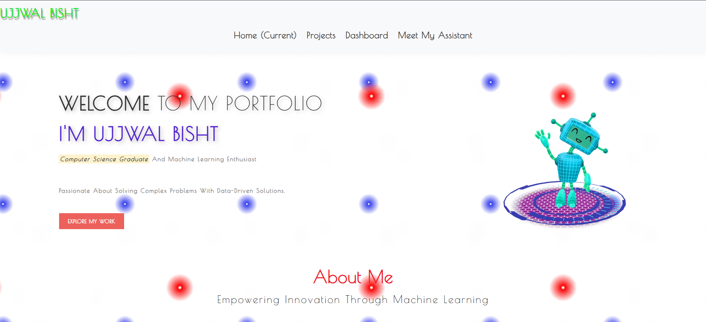
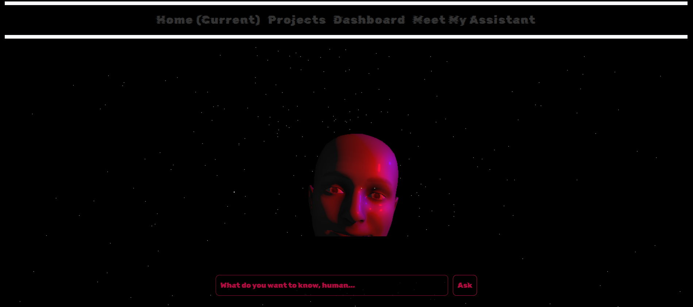
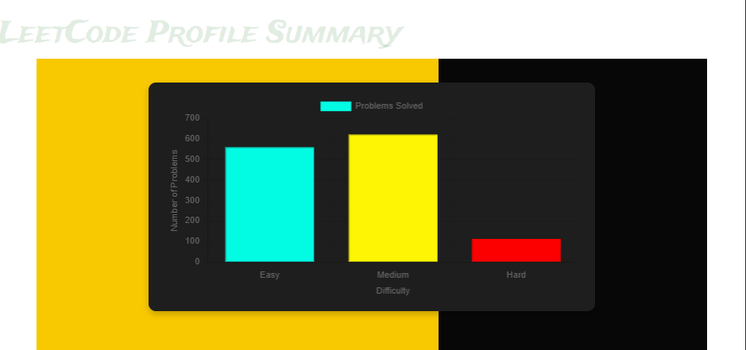
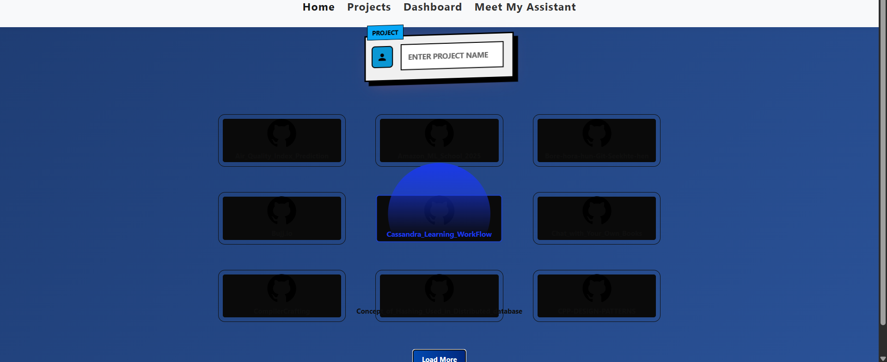

# 🚀 Bujj.io 

Bujj.io is a personal portfolio and interactive AI assistant web app that showcases:
- AI conversation (text + voice)
- LeetCode problem bar chart & calendar heatmap
- GitHub projects integration
- Smooth frontend + backend communication


---

## 📸 Screenshots




### 🎙️ AI Assistant


### 📊 LeetCode Bar Chart


### 📆 LeetCode Calendar Heatmap


### 💻 Project Showcase


---

## 📁 Project Structure

```
Bujj.io/
│
├── public/                   # Static files (CSS, JS, images, audio)
│   ├── css/
│   ├── js/
│   ├── screenshots/          # Screenshots used in README
│   └── audio/
│
├── templates/                # Handlebars views
│   ├── views/
│   ├── posts/
│   └── partials/
│
├── models/                   # Mongoose models
├── db/                       # Database connection
├── app.js                    # Main Express app
├── .env                      # Environment variables (add H_FACE_KEY)
└── README.md
```

---

## ⚙️ Tech Stack

- **Frontend:** HTML, CSS (Bootstrap), JavaScript (Chart.js, Three.js)
- **Backend:** Node.js, Express.js, Handlebars
- **AI Models:** HuggingFace (Blenderbot, SpeechT5)
- **APIs:** LeetCode GraphQL, GitHub API

---

## 🧠 Features

- 🎤 Chat with AI assistant (text-to-speech output)
- 📊 Visualize LeetCode stats by difficulty
- 📅 Calendar view of LeetCode submission activity
- 🔍 Dynamic GitHub project fetcher
- ✉️ Contact form to store user messages in MongoDB

---

## 🔐 Environment Variables

Create a `.env` file in the root:

```
H_FACE_KEY=your_huggingface_api_key
GITHUB_ACCESS_TOKEN=your_github_token
PORT=1000
```

---

## 🚀 Run Locally

```bash
git clone https://github.com/teche74/Bujj.io.git
cd Bujj.io

npm install
npm start
```

Then visit: [http://localhost:1000](http://localhost:1000)

---

## 📝 License

MIT License. Free to use with attribution.

---

## 🙋‍♂️ Author

Made with ❤️ by [Ujjwal Bisht](https://github.com/teche74)
